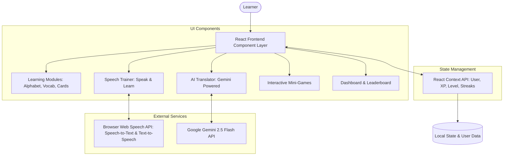

# 🌟 Kannada Learning AI Platform

An interactive, gamified, and AI-powered web application designed to make learning the Kannada language engaging, effective, and accessible for learners of all levels.


---

## 🎯 Overview

Learning a new regional language like Kannada can be challenging without real-time practice and interactive tools. The **Kannada Learning AI Platform** bridges this gap by combining traditional language pedagogy with modern web technologies and Generative AI. 

Whether you are learning basic alphabets, practicing real-life conversation scenarios, or sharpening your vocabulary through interactive mini-games, this platform provides instant feedback and dynamic progression.

---

## 🏗️ System Architecture



---

## ✨ Comprehensive Feature Breakdown

### 📚 1. Structured Learning Modules
- **Alphabet Learner (`AlphabetLearner.jsx`)**: 
  - Interactive grid displaying Kannada vowels (*Swaragalu*) and consonants (*Vyanjanagalu*).
  - English phonetic transliterations and sample words for pronunciation accuracy.
  - Native text-to-speech sound playback for every letter.
- **Vocabulary Builder (`VocabularyBuilder.jsx`)**:
  - Essential categories including **Greetings, Numbers, Food & Dining, Travel, and Daily Phrases**.
  - Audio pronunciation triggers and interactive flip-card layout.
- **Conversation Cards (`ConversationCards.jsx`)**:
  - Real-world dialogue simulations (e.g., ordering food, taking an auto-rickshaw, asking directions).
  - Displays original Kannada script, English transliteration, and English translation.

### 🗣️ 2. AI & Speech-Driven Trainer
- **Interactive Speech Trainer (`SpeakAndLearn.jsx`)**:
  - Integrates the **Web Speech API** (`SpeechRecognition` & `SpeechSynthesis`).
  - Audio pronunciation evaluation allowing users to listen to reference audio, record their voice, and check phonetic accuracy.
- **Contextual AI Translator (`TranslatorSection.jsx`)**:
  - Powered by **Google Gemini 2.5 Flash API**.
  - Performs intelligent English $\leftrightarrow$ Kannada translation.
  - Explains sentence breakdown, grammatical nuances, and alternative colloquial phrasing.

### 🎮 3. Gamified Learning Mini-Games
- 🔄 **Word Match (`WordMatchGame.jsx`)**: Match Kannada words with their English equivalents under time constraints.
- ✍️ **Fill in the Blanks (`FillInTheBlanksGame.jsx`)**: Contextual sentence completion to test grammar and vocabulary understanding.
- 🧠 **Memory Flashcards (`MemoryFlashcardGame.jsx`)**: Flip and match pair grid game designed for long-term memory retention.

### 🏆 4. Gamification & User Analytics
- **XP & Level Progression Engine**:
  - Earn Experience Points (XP) by completing lessons, winning mini-games, and practicing speech.
  - Automatic Level-Up formula: $\text{Level} = \lfloor \frac{\text{XP}}{100} \rfloor + 1$.
- **Daily Streaks**: Encourages daily habit formation by tracking continuous learning days.
- **Leaderboard & Profile (`LeaderboardPage.jsx`, `ProfilePage.jsx`)**: Dynamic user ranking dashboard displaying badges, achievements, level rankings, and user stats.

---

## 🛠️ Tech Stack & Key Libraries

| Category | Technology | Usage |
| :--- | :--- | :--- |
| **Framework** | React 18 | Declarative component UI design |
| **Build Tool** | Vite | Lightning-fast HMR and bundle optimization |
| **Styling** | Tailwind CSS | Modern layout, glassmorphism visuals & dark theme |
| **Animations** | Framer Motion & Lottie | Page transitions, interactive micro-animations |
| **Icons** | Lucide React | Clean, intuitive user interface icons |
| **State** | React Context API | Global XP, streak, and user profile state management |
| **AI Integration** | Google Gemini API | Real-time translation & contextual language assistance |
| **Speech** | Web Speech API | Native browser speech recognition & text-to-speech synthesis |

---

## 🚀 Getting Started Locally

### Prerequisites
Ensure you have **Node.js** (v16.0 or higher) installed on your system.

### 1. Clone the repository
```bash
git clone https://github.com/Shubh-Mehta26-26/learnkannada.git
cd learnkannada
```

### 2. Install dependencies
```bash
npm install
```

### 3. Configure Environment Variables
Create a `.env` file in the root directory:
```env
VITE_GEMINI_API_KEY=your_google_gemini_api_key_here
```
*(Get your free API key from [Google AI Studio](https://aistudio.google.com/))*

### 4. Run the Development Server
```bash
npm run dev
```
Navigate to `http://localhost:5173` in your browser.

---

## 🌐 Deployment Guide (Vercel / Netlify)

### Deploying to Vercel

1. Push your repository to GitHub.
2. Log into [Vercel](https://vercel.com/) and click **New Project**.
3. Import your `learnkannada` repository.
4. In the **Environment Variables** section, add:
   - Key: `VITE_GEMINI_API_KEY`
   - Value: `your_gemini_api_key_here`
5. Click **Deploy**.

---

## 📜 Project Directory Tree

```text
learnkannada/
├── public/                  # Static assets and media
├── src/
│   ├── components/
│   │   ├── games/           # Mini-game implementations (WordMatch, Flashcards, Fill-Blanks)
│   │   ├── learn/           # Core learning modules (Alphabet, Vocab, Speech, Translator)
│   │   └── ui/              # Shared UI design elements
│   ├── context/
│   │   └── AppContext.jsx   # Global state for XP, Level, Streaks, and User metadata
│   ├── pages/               # Main page routes (Home, About, Learn, Games, Dashboard, Profile)
│   ├── services/
│   │   └── gemini.js        # Gemini API integration service layer
│   ├── App.jsx              # Main App wrapper & navigation handler
│   ├── index.css            # Tailwind directives & global styling rules
│   └── main.jsx             # React DOM root renderer
├── .env                     # Environment variables (git-ignored)
├── package.json             # Dependencies and build scripts
├── tailwind.config.js       # Tailwind CSS custom configurations
└── vite.config.js          # Vite build config
```

---

## 🗺️ Roadmap & Future Enhancements

- [ ] 📱 **PWA Support**: Offline mode support for alphabet and vocabulary modules.
- [ ] 🎙️ **Speech Feedback Accuracy Score**: Detailed pronunciation scoring algorithm using audio frequency processing.
- [ ] 👥 **Multiplayer Challenges**: Challenge friends in real-time Kannada vocabulary duels.
- [ ] 📜 **Certificate Generation**: Earn downloadable completion certificates upon reaching milestone levels.

---

## 📄 License

This project is open-source under the [MIT License](LICENSE).

---

<p center>Crafted with ❤️ to promote regional language learning using modern web technology & AI.</p>